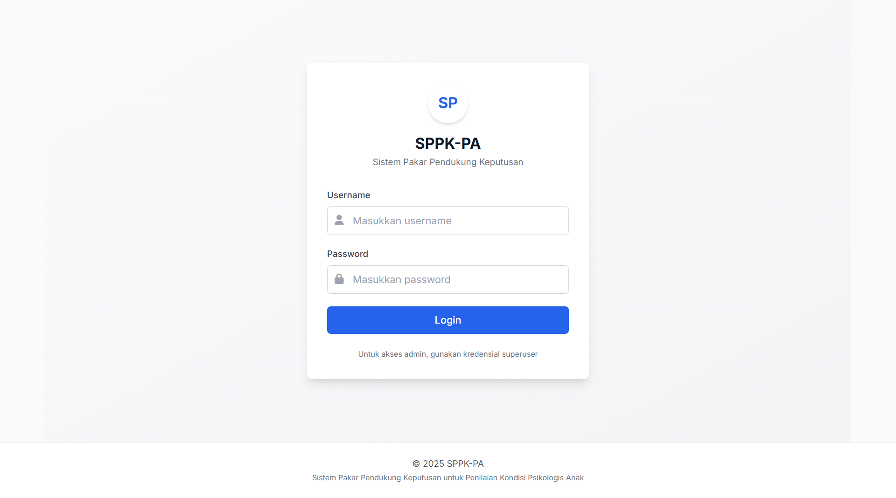
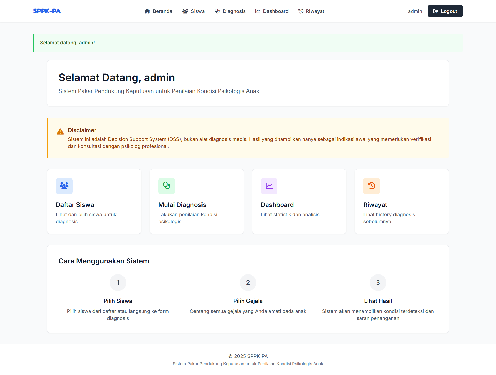
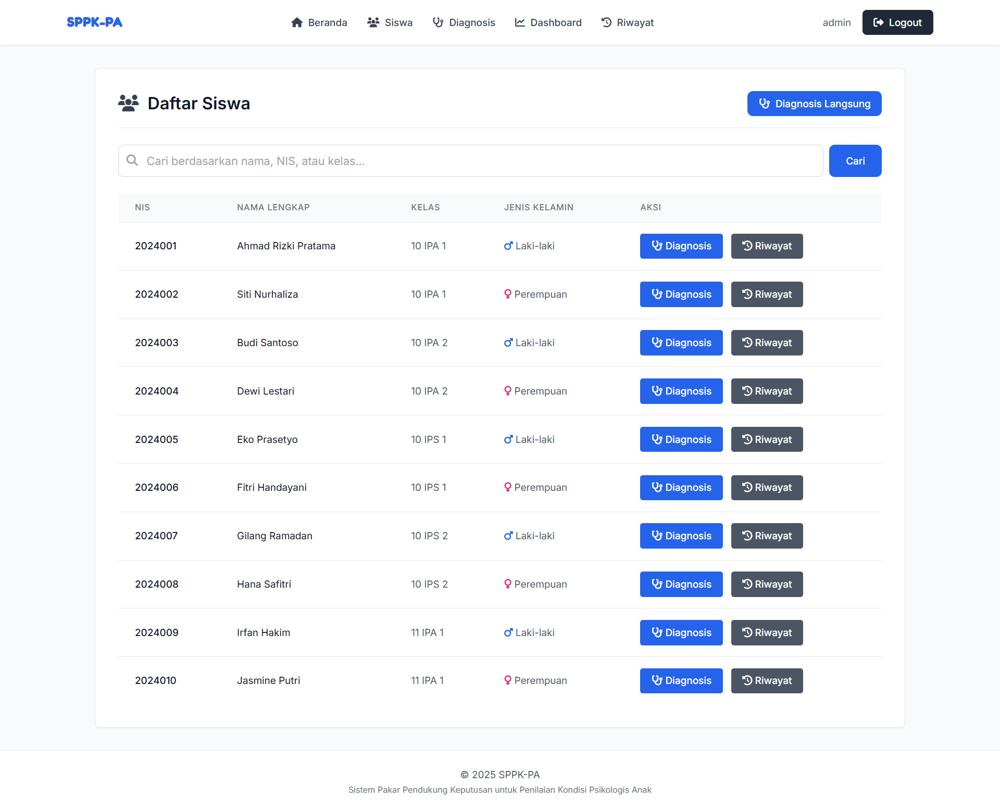
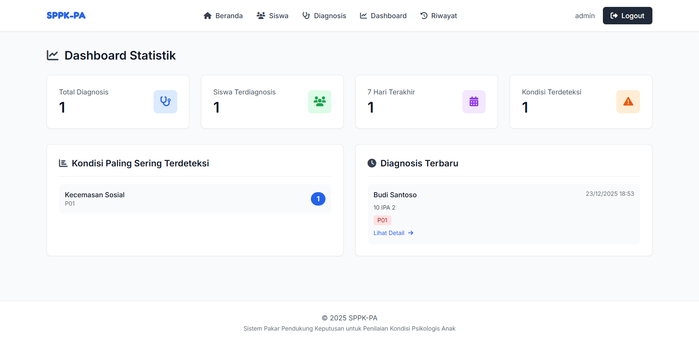
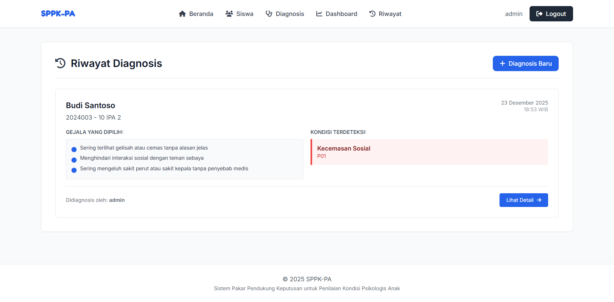

# SPPK-PA

<div align="center">

[](https://github.com/zidan-idz)
[](https://www.python.org/)
[](LICENSE)

**SPPK-PA** adalah aplikasi Sistem Pakar berbasis web untuk penilaian awal (screening) kondisi psikologis siswa menggunakan metode Forward Chaining.

</div>

## 🛠️ Tech Stack

<div align="center">


</div>

## 📦 Instalasi

1.  **Clone Repository**
    ```bash
    git clone https://github.com/username-anda/SPPK-PA.git
    cd SPPK-PA
    ```

2.  **Setup Virtual Environment**
    ```bash
    python -m venv venv
    # Windows: venv\Scripts\activate
    # Mac/Linux: source venv/bin/activate
    ```

3.  **Install Dependencies**
    ```bash
    pip install -r requirements.txt
    ```

4.  **Konfigurasi Environment**
    ```bash
    # Salin file .env.example menjadi .env
    cp .env.example .env
    ```

5.  **Setup Database & Admin**
    ```bash
    python manage.py migrate
    python manage.py load_sample_data   # Opsional: Load data pakar (Gejala/Rules)
    python manage.py createsuperuser    # Buat akun admin untuk login
    ```

6.  **Jalankan Aplikasi**
    ```bash
    python manage.py runserver
    ```
    Buka di browser: `http://127.0.0.1:8000/`

## ❓ Q&A (Tanya Jawab & Panduan)

**Q: Apa fungsi utama aplikasi ini?**

A: Aplikasi ini berfungsi sebagai alat bantu (screening) bagi guru BK atau psikolog sekolah untuk mendeteksi potensi masalah psikologis pada siswa. Sistem menggunakan basis pengetahuan pakar (Expert System) dengan metode Forward Chaining.

**Q: Bagaimana cara login dan menggunakan sistem?**

A: Gunakan **username** dan **password** akun superuser yang telah Anda buat pada tahap instalasi (Langkah 5).
*(Jika belum punya, buat via terminal: `python manage.py createsuperuser`)*

Setelah login, masuk ke **Menu Siswa** untuk input data, lalu ke **Menu Diagnosis** untuk memulai penilaian.

**Q: Bagaimana cara mengubah Knowledge Base (Gejala/Penyakit)?**

A: Sistem ini dinamis. Login ke aplikasi, lalu akses URL `/admin` (panel admin Django). Di sana Anda bisa menambah/edit/hapus Conditions (Penyakit), Symptoms (Gejala), dan Rules (Aturan).

**Q: Apakah data aman dan bisa di-backup?**

A: Secara default menggunakan database `db.sqlite3` lokal. Untuk backup, cukup copy file tersebut. Untuk produksi, disarankan menggunakan PostgreSQL/MySQL.

**Q: Mengapa muncul "No module named..." saat instalasi?**

A: Pastikan virtual environment aktif sebelum `pip install`. Coba juga update pip: `python -m pip install --upgrade pip`.

**Q: Apakah aplikasi ini responsif di HP?**

A: Ya! SPPK-PA dibuat untuk sepenuhnya responsif di HP, Tablet, dan Laptop dengan menggunakan Tailwind CSS.

**Q: Lupa password admin, bagaimana cara reset?**

A: Reset via terminal: `python manage.py changepassword username_anda`.

---

## 📸 Dokumentasi (Screenshots)

Berikut adalah tampilan antarmuka aplikasi:

| Halaman Login | Dashboard |
|:-------------:|:---------:|
|  |  |

| Proses Diagnosis | Hasil Diagnosis |
|:----------------:|:---------------:|
|  |  |

| Riwayat | Laporan Detail |
|:-------:|:--------------:|
|  |  |


